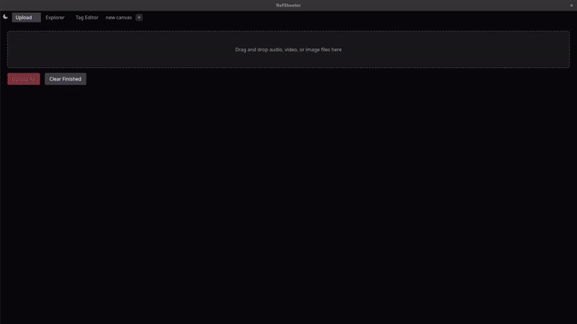
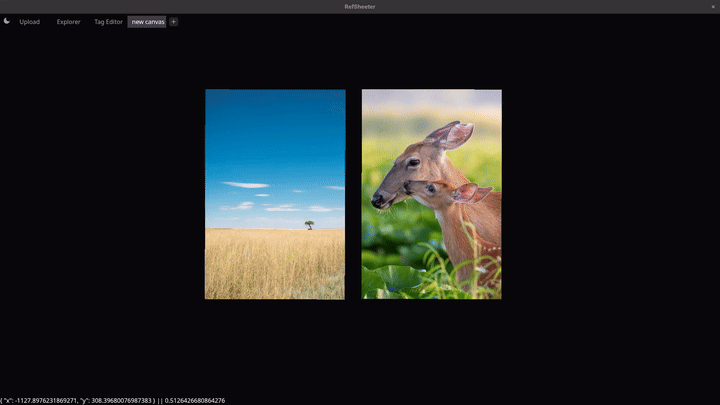

# RefTagger

> A modern, high-performance Media & Art Reference Manager built for visual artists, designers, and creators.

---

## Project Status

**RefTagger is currently an active proof-of-concept / early demo.** 

The core architecture, tag indexing system, and initial canvas workspace are implemented as a foundation for further feature development.

---

## Core Features & Concept

  

  

* **Interactive Canvas Workspace**
  * A fluid reference canvas designed for arranging and viewing visual assets side-by-side during creative sessions.
* **Advanced Tagging & Search**
  * **Custom Colors:** Assign custom colors to tags.
  * **Precision Querying:** Filter libraries using search modifiers: require tags (`!tag`), exclude (`-tag`), or use wildcard operators (`prefix_*_suffix`).
* **Command & Tab System**
  * Multi-tab workspace navigation and a keyboard-driven command palette workflow.
* **Media Support**
  * Support for images and animated GIFs.

---

## Tech Stack

* **Desktop Shell:** [Electron](https://www.electronjs.org/)
* **Frontend Framework:** [Vue.js](https://vuejs.org/) (TypeScript)
* **UI Components:** [PrimeVue](https://primevue.org/)
* **Styling:** [Tailwind CSS](https://tailwindcss.com/)
* **Database & ORM:** [SQLite](https://www.sqlite.org/) + [Prisma](https://www.prisma.io/)
* **Utilities:** [hotkeys-js](https://github.com/jaywcjlove/hotkeys-js) (Keyboard shortcut management)
  
---

## Roadmap

- [ ] **Hierarchical Tagging:** Support for tag categories and nested subtags.
- [ ] **Extended Format Support:** Video files (`.mp4`, `.webm`) and 3D assets.
- [ ] **Canvas Enhancements:** Notes, drawing, auto-arrange, groups.
- [ ] **Smart Canvas:** Automatically add files based on tags.

---

## License

Distributed under the [MIT License](LICENSE).
